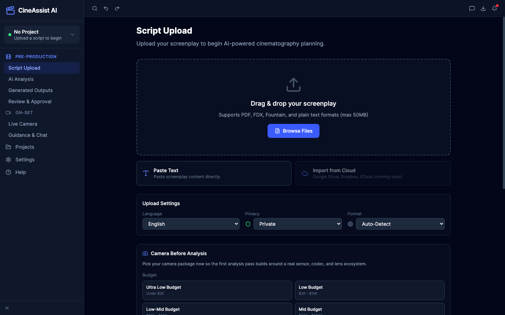

# CineAssist Local Setup



This project now runs locally with:

- a Vite frontend on `http://localhost:5173`
- an Express backend on `http://localhost:3002`
- TokenRouter (cloud, Qwen) as the primary AI provider, with Ollama as a local fallback if it's unset or fails
- optional MongoDB

If MongoDB is not running, the backend automatically falls back to a local JSON datastore at [server/data/local-store.json](/Users/yugrajkhadka/AI-assistance-prototype/server/data/local-store.json).

## 1. Install dependencies

```bash
npm install
cd server && npm install
```

## 2. (Optional) Start Ollama for local fallback

Install Ollama, then pull a local model:

```bash
ollama pull llama3
```

Make sure Ollama is running locally on `http://localhost:11434`. This is only used when TokenRouter is unset or a request to it fails.

## 3. Configure the backend

The backend reads [server/.env](/Users/yugrajkhadka/AI-assistance-prototype/server/.env). The important local settings are:

```env
PORT=3002

# Primary AI provider (cloud) — tried first
TOKENROUTER_API_KEY=your-tokenrouter-api-key
TOKENROUTER_BASE_URL=https://api.tokenrouter.com/v1
TOKENROUTER_MODEL=qwen/qwen3.8-max-free

# Local fallback if TokenRouter is unset or fails
LOCAL_LLM_API_URL=http://localhost:11434/api/generate
LOCAL_LLM_MODEL=llama3
OLLAMA_BASE_URL=http://localhost:11434
```

If `TOKENROUTER_API_KEY` is empty, the backend skips straight to Ollama. MongoDB is optional — if `MONGODB_URI` is unreachable, the server will still start in local storage mode.

## 4. Run the app

In one terminal:

```bash
cd server
npm start
```

In another terminal:

```bash
npm run dev
```

## 5. Verify it

Open the frontend and:

1. Upload or paste a script.
2. Go to Analysis and run full analysis.
3. Open On-Set Guidance and send a chat prompt.

You can also check backend status at [http://localhost:3002/api/health](http://localhost:3002/api/health). It reports:

- whether storage is using MongoDB or the local file fallback
- whether Ollama is reachable
- which Ollama models are available

## Notes

- The frontend proxies `/api` to `http://localhost:3002` in development.
- If Ollama is not running, analysis calls will return a clear backend error telling you how to start it.
- Production build verification passed locally with `npm run build`.
